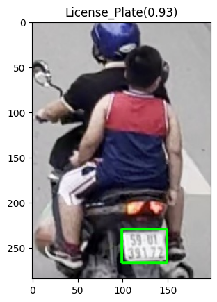
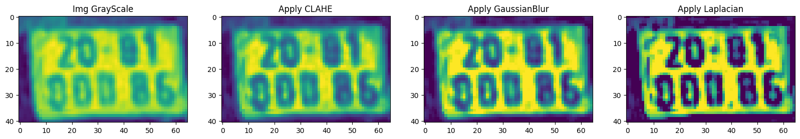
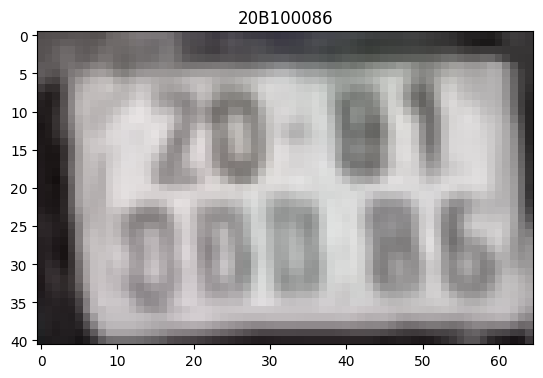

# Vehicle
Project này được xây dựng nhằm theo dõi các phương tiện giao thông, đồng thời phát hiện được biển số của phương tiện đó.
## Vehicle Tracking
Tracking các đối tượng trong mỗi frame trả về bbox của từng object (car, motor, bus, truck).

Mỗi object sẽ có một id rieng gắn liền với object đó trong suốt quá trình từ khi xuất hiện trên khung hình đến khi ròi khỏi khung hình.

Model sử dụng ở project này là `yolov9c.pt` của ultralytics. Bộ dữ liệu được khởi tạo từ các video giao thông tại một số cung đường, giao lộ trên địa bàn Hà Nội.

## License Plate Detection
Đây là module dùng để detect phần biển số có trong từng object được tách ra từ bước tracking.

  
   
  <em>Demo | License Plate Detection</em>

Model sẽ trả về bbox của biển số được phát hiện trong ảnh object.

## OCR
Ở đây tôi sử dụng model PaddleOCR, một model khá dễ dùng và thịnh hành hiện nay trong các bài toán OCR. Lý do tôi chọn model vì nó hỗ trợ cho cả tiếng anh và tiếng việt. Trong project này model sẽ được sử dụng để OCR phần text của biển số.

Tuy nhiên do có một số quy luật chung của biển số nên ta phải xử lý lại phần kết quả của quá trình OCR. ngoài ra để tăng độ chính xác của mô hình nên tôi cũng đã xử lý lại phần đầu vào trước khi đưa vào mô hình OCR.

  
   
  <em>Image Processing</em>

  
   
  <em>LicensePlate OCR</em>

# Demo
Video demo: [demo](https://drive.google.com/file/d/1PCXSWkS49slzfQqgOOt24IMec5civhkN/view?usp=drive_link)

Data Vehicle Tracking: [vehicletracking_dataset](https://drive.google.com/file/d/1w03UuNfQBP0Rt0Fgp-l4thHfGKmuhHWS/view?usp=drive_link)

Data LicensePlate Detection: [licenseplate_dataset](https://drive.google.com/file/d/13PChAtrnopdVB6mQOY1tHQXULJIRTWe6/view?usp=drive_link)

  
   
  <em>LicensePlate OCR</em>

Do bộ dữ liệu chưa đủ lớn cũng như chất lượng hình ảnh, tài nguyên tính toán nên mô hình hoạt động còn kém. Đặc biệt là về phần OCR tôi mới chỉ sử dụng mô hình nguyên bản, chưa fine tunrning với dữ liệu là biển số xe của VN do đó vẫn có trường hợp trả về kết quả sai khi OCR.